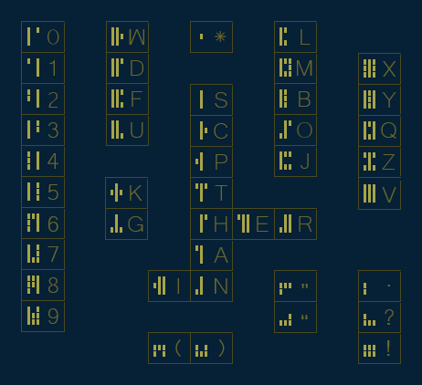

# Limin-Letter-System
A script to generate text's using a letter system witch is written from top to bottom.

  

 Usage:

  While in Gamemode of the Unity3d Editor you can Write using the supported characters.
  The right arrow key is used to switch to the next collum, texts can be computed by pressing backspace.
  You can save the generated Image by pressing Enter the save location is rootdirectory/SaveImages/Image.png.

  Supported Chracters: 0123456789 ABCDEFGHIJKLMNOPQRSTUVWXYZ .?!\"'*()
